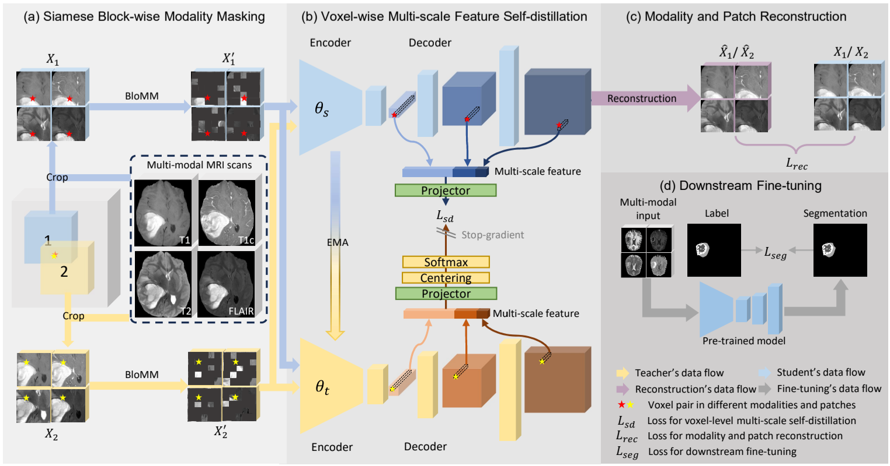

# Vox-MMSD: Voxel-wise Multi-scale and Multi-modal Self-Distillation for Self-supervised Brain Tumor Segmentation
---
This is the official code for Vox-MMSD: Voxel-wise Multi-scale and Multi-modal Self-Distillation for Self-supervised Brain Tumor Segmentation.


[2025-07] Our work has been accepted by Journal of Biomedical and Health Informatics (JBHI).


## ✨Overall Framework


Our contributions are summarized as follows:
- We propose a self-supervised multi-modal pre-training framework for brain tumor segmentation, which can extract modality-invariant representations from multi-modal MRI scans for improved performance on small downstream segmentation datasets.
- To learn modality-invariant features, we introduce **SiaBloMM** to generate siamese blocks as model inputs, which introduces independent spatial and modality masking to the input during model pre-training.
- To enhance the voxel-level feature representation ability for segmentation, we propose **ORMS** that generates voxel pairs with perturbed local context and modality set, which is combined with multi-scale self-distillation for effectively learning both global and local contextual features.


## 📁Dataset
Download the BraTS-GLI dataset from [BraTS 2023](https://www.synapse.org/#!Synapse:syn51156910/wiki/), and put them in the ./BraTS-GLI/source_data/, use
`python ./BraTS-GLI/create_dataset_csv.py`
to preprocess the data and get .csv file for training

## 🔨How to use
1. Move into the Pymic-dev and install
```
    cd PyMIC-dev
    pip install -e .
```
2. Move back to the Vox-MMSD dir and run training command
```
    cd ..
    pymic_train ./BraTS-GLI/config/unet3d_voxmmsd.cfg
```

## 🙏Acknowledgement
Our codebase is built upon the [Pymic](https://github.com/HiLab-git/PyMIC.git), and refers to [DINO](https://github.com/facebookresearch/dino) and [Vox2Vec](https://github.com/mishgon/vox2vec.git).​
